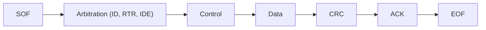
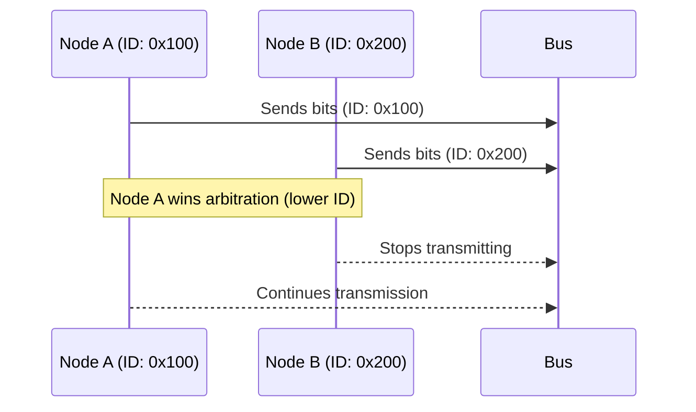
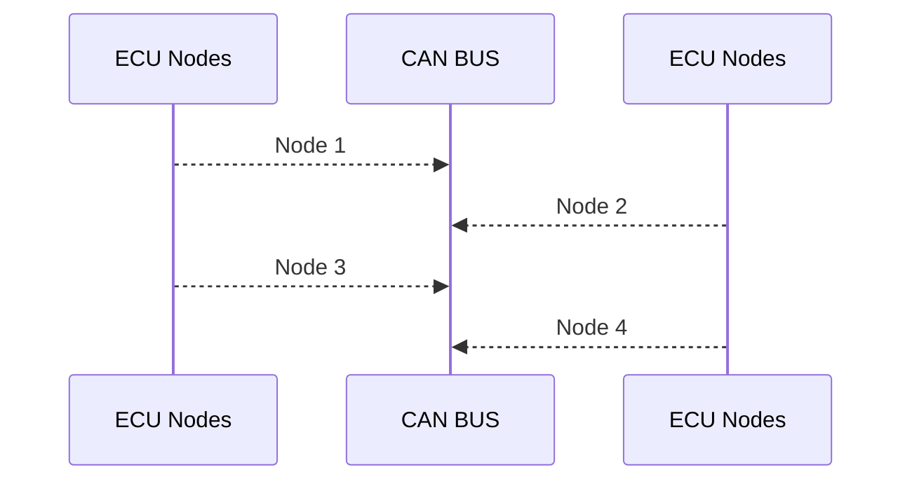

# 🚌 Controller Area Network (CAN): The Nervous System of a Car

Ever wonder how the dozens of electronic control units (ECUs) in a modern car talk to each other? From your engine and transmission to your power windows and dashboard, they all need to communicate reliably. This is where the **Controller Area Network (CAN)** comes in.

Think of CAN as a super-reliable, high-speed **party line for electronics**. Every component can hear every message, but they only pay attention to the ones that are important to them. It's a robust and efficient system designed to work in the noisy electrical environment of a vehicle, and it's the backbone of nearly all modern automotive communication.

This guide will dive into the technical details of how the CAN protocol works, from its physical signals to its clever error-handling mechanisms.

---

## 🚗 Anatomy of a CAN Message: A Step-by-Step Journey

The best way to understand CAN is to follow a single message on its journey through the bus. Let's imagine a message from the **Engine Control Unit (ECU)** that broadcasts the current vehicle speed.

**Our Scenario:**
*   **Sender:** Engine ECU
*   **Message:** Vehicle Speed
*   **Identifier (ID):** `0x123` (a low ID, making it high priority)
*   **Data:** The current speed is **80.5 km/h**. We'll represent this in two bytes.
*   **Receivers:** The Dashboard ECU (to display the speed) and the Transmission ECU (to help decide when to shift gears).

### Step 1: The Engine ECU Constructs the Frame

The Engine ECU has a new speed reading and needs to send it. It assembles a **Data Frame**.

1.  **Identifier:** It sets the Arbitration field to `0x123`.
2.  **Data Payload:** It converts 80.5 km/h into a format it can send. For example, it might scale it by 100 to send an integer: `8050`. In hexadecimal, that's `0x1F72`. It places this into two data bytes: `[0x1F, 0x72]`.
3.  **Data Length Code (DLC):** Since it's sending 2 bytes of data, it sets the DLC to `2`.
4.  **CRC:** The CAN controller automatically calculates the Cyclic Redundancy Check (CRC) checksum to ensure data integrity.

The frame is now ready to be transmitted.

### Step 2: Arbitration on the Bus

The Engine ECU listens to the bus. If the bus is idle (in a recessive state), it starts transmitting its frame, bit by bit, starting with the high-priority ID `0x123`.

At the exact same time, maybe the Airbag ECU tries to send a non-critical status message with ID `0x555`.

*   Both ECUs transmit their IDs.
*   As soon as the Airbag ECU sends a `1` (recessive) where the Engine ECU sends a `0` (dominant), the Airbag ECU detects the conflict.
*   **The Airbag ECU immediately stops transmitting** and waits for the bus to be free again. It lost arbitration.
*   The Engine ECU's high-priority message continues completely uninterrupted, as if nothing happened.

This is the magic of CAN's non-destructive arbitration!

### Step 3: Reception and Acknowledgment

The `0x123` message travels down the bus and is received by **all** connected ECUs, including the Dashboard and Transmission.

*   **Filtering:** The Dashboard and Transmission ECUs are programmed to care about ID `0x123`. They read the message. The Power Window ECU, however, doesn't care about vehicle speed, so it simply ignores the message after reading the ID.
*   **Acknowledgment (ACK):** The Dashboard and Transmission ECUs, having received the message correctly, will both transmit a **dominant** bit during the ACK slot of the frame. The Engine ECU sees this dominant bit and knows its message was successfully received by at least one other node.

### Step 4: What if Something Went Wrong?

Imagine a burst of electrical noise corrupted one of the data bytes.

*   The receiving ECUs (Dashboard and Transmission) would calculate the CRC on the data they received.
*   Their calculated CRC would not match the CRC sent by the Engine ECU.
*   They would detect a **CRC Error** and immediately transmit an **Error Frame** to invalidate the message for all nodes on the bus.
*   The Engine ECU would see the Error Frame, its Transmit Error Counter (TEC) would increase, and it would automatically try to re-transmit the message once the bus is free.

This journey shows how CAN uses IDs for priority, broadcasts messages, and has built-in mechanisms to ensure reliable delivery.

---

## 📝 Overview

Let's start with a high-level look at what makes CAN, CAN.

| Feature         | Description                                                                 |
|-----------------|-----------------------------------------------------------------------------|
| Type            | Serial, multi-master, message-oriented protocol                             |
| Reliability     | High, with robust error detection and fault tolerance                       |
| Applications    | Automotive, industrial automation, aerospace, medical, robotics, avionics   |
| Physical Layer  | Twisted pair, differential signaling (CAN_H, CAN_L), terminated at both ends|

---

## 📚 CAN Basics

Here are some of the fundamental properties and rules of a CAN network.

| Aspect         | Details                                                                 |
|----------------|------------------------------------------------------------------------|
| Standard       | ISO 11898                                                               |
| Max Nodes      | 112 (practical: 32–64, depends on transceivers and bus length)          |
| Message Type   | Broadcast (all nodes receive all messages, filtering by identifier)     |
| Addressing     | Identifier-based (not node address)                                     |
| Error Handling | Automatic retransmission, error counters, fault confinement             |

---

## 🔄 CAN vs. Other Protocols

| Protocol | Topology      | Max Data Rate         | Distance                | Use Case                        | Arbitration | Addressing      |
|----------|---------------|----------------------|-------------------------|----------------------------------|-------------|-----------------|
| CAN      | Multi-master  | 1 Mbps (CAN FD: 8-10 Mbps) | Long (up to 1 km at low speeds) | Automotive, industrial, aerospace | Yes         | Identifier-based|
| I2C      | Multi-master  | 400 kbps             | Short (few meters)      | On-board communication           | Yes         | Address-based   |
| UART     | Point-to-point| 1 Mbps+              | Medium                  | Serial comm. between two devices | No          | N/A             |
| LIN      | Single-master | 20 kbps              | Short                   | Low-cost automotive subsystems   | No          | Identifier-based|
| Ethernet | Multi-master  | 10 Mbps+             | Long (100m+)            | LAN/WAN, high-speed networking   | Yes         | MAC address     |

---

## 🧩 CAN Frame Types & Structure

Data on the CAN bus is sent in packets called **frames**. While there are a few different types for data, remote requests, and errors, the most important one to understand is the Data Frame. Let's break down its structure.

### Frame Types

| Frame Type    | Purpose           | Key Fields/Notes                                                                 |
|---------------|-------------------|----------------------------------------------------------------------------------|
| Data Frame    | Transmit data     | Identifier, data, control, CRC, ACK, SOF, EOF                                    |
| Remote Frame  | Request data      | Like Data Frame, but RTR bit set; no data field                                  |
| Error Frame   | Signal errors     | Error flag (6-12 dominant bits), error delimiter (8 recessive bits)              |
| Overload Frame| Delay transmission| Overload flag (6-12 dominant bits), overload delimiter (8 recessive bits)        |

### Frame Structure

| Field         | Function                                                                 |
|---------------|--------------------------------------------------------------------------|
| SOF           | Start of Frame (synchronization)                                         |
| Arbitration   | Identifier (11/29 bits), RTR/SRR/IDE bits                                |
| Control       | Frame type, data length, error flags                                     |
| Data          | Payload (0-8 bytes, up to 64 bytes for CAN FD)                           |
| CRC           | Error detection (15 bits + delimiter)                                    |
| ACK           | Acknowledgment (slot + delimiter)                                        |
| EOF           | End of Frame (7 recessive bits)                                          |

**Mermaid Diagram: CAN Data Frame Structure**

---

## 🆔 CAN Identifiers

| Type      | Bits | Max Unique IDs | Use Case                  |
|-----------|------|----------------|---------------------------|
| Standard  | 11   | 2,048          | Classical CAN (CAN 2.0A)  |
| Extended  | 29   | 536 million    | CAN 2.0B, time-critical   |

- **Lower identifier = higher priority**

---

## 🚦 Bit Rate and Bus Length

| CAN Type   | Max Bit Rate | Typical Rates         | Max Bus Length*         |
|------------|--------------|----------------------|-------------------------|
| Classical  | 1 Mbps       | 125k, 250k, 500k, 1M | ~40m @ 1 Mbps           |
| CAN FD     | 8-10 Mbps    | 2M, 5M, 8M           | Shorter at higher rates |

\* Longer buses require lower bit rates.

---

## 🧵 Bit Stuffing

- **Purpose:** Prevents long runs of identical bits, maintains synchronization.
- **Rule:** After 5 consecutive identical bits, insert opposite bit.

---

## 🔌 Physical Layer

The physical layer is how the 1s and 0s actually travel across the wires. CAN uses a clever trick called **differential signaling**. Instead of one wire, it uses two (CAN High and CAN Low).

Think of it like this:
*   **Recessive (1):** The 'idle' or 'quiet' state. Both wires are at the same voltage (~2.5V).
*   **Dominant (0):** The 'active' or 'shouting' state. One wire goes up, the other goes down. A dominant '0' will always overwrite a recessive '1' on the bus. This is the key to how arbitration works!

| Signal | Dominant (0) | Recessive (1) |
|--------|--------------|---------------|
| CAN_H  | ~3.5V        | ~2.5V         |
| CAN_L  | ~1.5V        | ~2.5V         |
| Diff.  | >2V          | ~0V           |

- **Termination:** 120Ω at each end.
- **Shielding:** Optional for EMI protection.

---

## ⚡ Arbitration & Priority

What happens if two ECUs try to 'talk' at the same time? CAN has a brilliant, non-destructive way to handle this called **arbitration**. It's a key feature that ensures the most important messages always get through without being corrupted.

- **Identifier-based:** Lower value = higher priority.
- **Collision resolution:** Node with higher identifier stops transmitting.
- **Retransmission:** Losing nodes retry after delay.

**Mermaid Diagram: Arbitration Process**

---

## 🛡️ Error Detection, States & Handling

What makes CAN so robust? Its sophisticated, built-in error handling. The protocol has several mechanisms to detect errors, and nodes can even kick themselves off the bus if they are causing too many problems, which prevents a faulty node from bringing down the entire network.

### Error Detection & Handling

| Error Type   | Cause/Detection                  | Handling/Effect                      |
|--------------|----------------------------------|--------------------------------------|
| Bit Error    | Bit mismatch                     | Error frame, increment error counter |
| Stuff Error  | Bit stuffing rule violated       | Error frame, increment error counter |
| CRC Error    | CRC mismatch                     | Error frame, discard frame           |
| Form Error   | Frame format invalid             | Error frame, discard frame           |
| ACK Error    | No ACK received                  | Retransmit, increment error counter  |

- **Error Counters:** Transmit (TEC) and Receive (REC) counters determine node state (Active, Passive, Bus Off).
- **Error Frames:** Sent to signal errors, isolate faulty nodes (fault confinement).

### CAN Error States

| State         | Description                                  |
|---------------|----------------------------------------------|
| Error Active  | Normal operation, can transmit/receive       |
| Error Passive | Limited transmission, can receive            |
| Bus Off       | Disconnected due to excessive errors         |

### CAN Error Handling Rules (Summary)

- **Error counters increment/decrement based on error type and recovery.**
- **Dominant bits after error flags are tolerated up to a limit.**
- **Transmit error counter decrements after successful transmission.**

---

## 🚀 CAN FD vs. Classical CAN

| Feature         | Classical CAN | CAN FD         |
|-----------------|--------------|----------------|
| Max Data Rate   | 1 Mbps       | 8-10 Mbps      |
| Max Payload     | 8 bytes      | 64 bytes       |
| Backward Compat.| N/A          | Yes            |
| Complexity      | Lower        | Higher         |

---

## 🏢 Higher Layer Protocols

| Protocol | Layer | Use Case                | Features/Notes                        |
|----------|-------|-------------------------|---------------------------------------|
| CANopen  | App   | Industrial automation   | Device/network mgmt, plug-and-play    |
| J1939    | App   | Heavy-duty vehicles     | Standardized messages, diagnostics    |
| OBD-II   | App   | Vehicle diagnostics     | Emissions, fault codes, uses CAN      |

---

## 🛠️ Fault Tolerance & Recovery

| Feature         | Description                                                                 |
|-----------------|-----------------------------------------------------------------------------|
| Redundancy      | Dual buses, backup nodes                                                    |
| Bus Off Recovery| Reset controller, clear errors, retry after delay                           |
| Error Confinement| Nodes move between Active, Passive, Bus Off states based on error counters |

---

## ⏱️ Real-Time & Deterministic Behavior

| Technique           | Description                                      |
|---------------------|--------------------------------------------------|
| Time-Triggered CAN  | Scheduled time slots for messages (TTCAN)        |
| Priority Arbitration| Critical messages get lower identifiers          |
| Synchronization     | Node clocks synchronized for accurate timing     |
| Redundancy          | Dual channels for failover                       |

---

## 🖧 Example: CAN Bus Topology

---

## ❓ Frequently Asked Questions

| Question | Answer |
|----------|--------|
| **What is the maximum number of nodes on a CAN bus?** | Up to 112 (practical: 32–64, depends on transceivers and bus length). |
| **What is the difference between CAN and CAN FD?** | CAN FD supports higher data rates (up to 8-10 Mbps) and larger payloads (up to 64 bytes). |
| **Why is bit stuffing used?** | To maintain synchronization and avoid long runs of identical bits. |
| **What happens if a node experiences too many errors?** | It transitions to Error Passive or Bus Off state for fault confinement. |

---

## 📚 References

- ISO 11898-1:2015 (CAN and CAN FD)
- Bosch CAN Specification
- CAN in Automation (CiA) documentation

---

*For diagrams and error illustrations, see the `data/` folder images referenced in the original document.*
