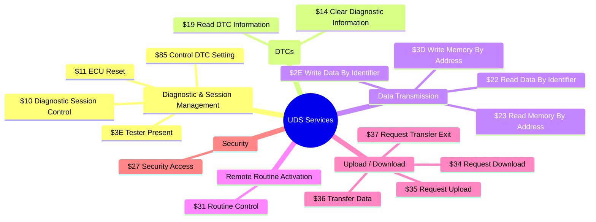

# ախ UDS: The Language of Car Diagnostics

Welcome to Unified Diagnostic Services (UDS)! If DoIP is the high-speed postal service, then UDS (ISO 14229) is the **language** spoken between a diagnostic tool and a vehicle's ECUs. It defines a standard set of "questions" and "answers" that allow a technician to diagnose problems, read data, and update software, regardless of the car's manufacturer.

This guide will introduce you to the core concepts of UDS and take you on a tour of its most common and useful services.

---

## 🤔 What is UDS and Why is it a "Unified" Standard?

**What is it?**
UDS is a diagnostic communication protocol used in automotive electronics. It defines the format of messages and the sequence of operations for a client (a diagnostic tool) to request information or actions from a server (an ECU).

**Why is it "Unified"?**
Before UDS, different manufacturers had their own proprietary diagnostic protocols, meaning a workshop needed different tools for every car brand. UDS created a common standard, so a single diagnostic tool can communicate with any UDS-compliant vehicle. It "unifies" the way we talk to cars.

---

## 🧠 UDS at a Glance: A Map of Services

UDS is a rich standard with many services. This mindmap categorizes the most common services to give you a high-level overview.

---

## 🧩 The Building Blocks: Core Concepts Explained

To understand UDS, you need to know a few key terms.

*   **Client & Server:** In UDS, the **Client** is the diagnostic tool (tester), and the **Server** is an ECU in the vehicle. The client sends a request, and the server sends a response.
*   **Service ID (SID):** This is a one-byte command that tells the ECU *what* you want to do. For example, `$22` is the SID for "Read Data By Identifier."
*   **Sub-function:** Some services have options. The sub-function is an optional byte that specifies *which* option you want. For example, in the Diagnostic Session Control service (`$10`), a sub-function of `$03` activates the "Extended Diagnostic Session."
*   **Positive/Negative Response:** If the ECU can perform the requested action, it sends a **Positive Response**. If it cannot, it sends a **Negative Response**.
*   **Negative Response Code (NRC):** If a request fails, the ECU sends back an NRC, which is a one-byte code that explains *why* it failed (e.g., `$7F` = Service Not Supported, `$31` = Request Out of Range).

---

## 📬 Anatomy of a UDS Message

A UDS communication is always a request-response pair. The messages are made up of hexadecimal bytes.

### Request Message

A request from the client (tester) typically looks like this:
`[SID] [Sub-function (optional)] [Parameters... (optional)]`

*   **Example:** Request to read the Vehicle Identification Number (VIN), which has the Identifier `$F190`.
    `[22 F1 90]`
    *   `22`: The SID for "Read Data By Identifier."
    *   `F1 90`: The two-byte identifier for the VIN.

### Response Message

**Positive Response (`+`)**
If successful, the ECU adds `$40` to the request SID for its response SID.
`[Response SID] [Original Sub-function/Parameters] [Response Data...]`

*   **Example:** Positive response for the VIN request.
    `[62 F1 90 V I N ...]`
    *   `62`: The positive response SID (`22` + `40` = `62`).
    *   `F1 90`: Echoes back the identifier that was requested.
    *   `V I N ...`: The actual 17-byte VIN data.

**Negative Response (`-`)**
If it fails, the response is always three bytes.
`[7F] [Request SID] [NRC]`

*   **Example:** Negative response if the VIN is not supported.
    `[7F 22 31]`
    *   `7F`: The SID for a negative response.
    *   `22`: Echoes back the SID of the original request.
    *   `31`: The NRC for "Request Out Of Range."

---

## 🛠️ A Practical Tour of Common UDS Services

This is where the real power of UDS becomes clear. Let's look at some of the most frequently used diagnostic services.

| Service | Name | Request Example | Positive Response Example | Common NRCs |
|---|---|---|---|---|
| **$10** | **Diagnostic Session Control** | `10 03` (Enter Extended Session) | `50 03` (Success) | `$7E` (Sub-function not supported) |
| **$11** | **ECU Reset** | `11 01` (Hard Reset) | `51 01` (Success) | `$22` (Conditions not correct) |
| **$19** | **Read DTC Information** | `19 02 09` (Report DTCs by status mask) | `59 02 ...` (List of DTCs) | - |
| **$14** | **Clear Diagnostic Information** | `14 FF FF FF` (Clear all DTCs) | `54` (Success) | `$31` (Request out of range) |
| **$22** | **Read Data By Identifier** | `22 F1 90` (Read VIN) | `62 F1 90 ...` (VIN data) | `$13` (Incorrect message length) |
| **$27** | **Security Access** | `27 01` (Request Seed) | `67 01 ...` (Seed bytes) | `$35` (Invalid key) |
| **$2E** | **Write Data By Identifier** | `2E F1 90 ...` (Write VIN) | `6E F1 90` (Success) | `$7F` (Service not supported) |
| **$3E** | **Tester Present** | `3E 80` (Suppress positive response) | (No response) | `$11` (Service not supported) |

---

## 🚀 A Real-World Scenario: Reading and Clearing Fault Codes

Let's see how these services work together in a typical diagnostic session to read and clear Diagnostic Trouble Codes (DTCs).

1.  **Enter Extended Session:** The client sends `10 03` to unlock more powerful services. The ECU responds `50 03`.
2.  **Request Security Access (if needed):** Some ECUs require security access to read or clear DTCs. The client sends `27 01` (Request Seed), the ECU responds with a seed (`67 01 ...`), the client calculates a key and sends it back (`27 02 ...`), and the ECU confirms (`67 02`).
3.  **Read Fault Codes:** The client sends `19 02 09` to ask for all DTCs. The ECU responds `59 02 ...` with a list of the currently active fault codes.
4.  **Clear Fault Codes:** After the issue is fixed, the client sends `14 FF FF FF` to clear all DTCs. The ECU responds `54`.
5.  **Read Fault Codes Again:** The client sends `19 02 09` again to confirm that the codes have been cleared. The ECU responds `59 02` with an empty list, confirming success.

---

## 🏅 Best Practices

*   **Always Check for a Negative Response:** Don't assume your request worked. A Negative Response Code (NRC) tells you *why* it failed.
*   **Handle Security Access:** Many powerful services (like writing data or clearing fault codes) require the ECU to be "unlocked" via the Security Access service (`$27`).
*   **Know Your Sessions:** The Diagnostic Session Control service (`$10`) changes the ECU's state. Be aware of what session you are in, as it affects which services are available.

---

## 🔗 Further Reading

*   [ISO 14229-1:2020](https://www.iso.org/standard/72439.html) (The official UDS standard)
