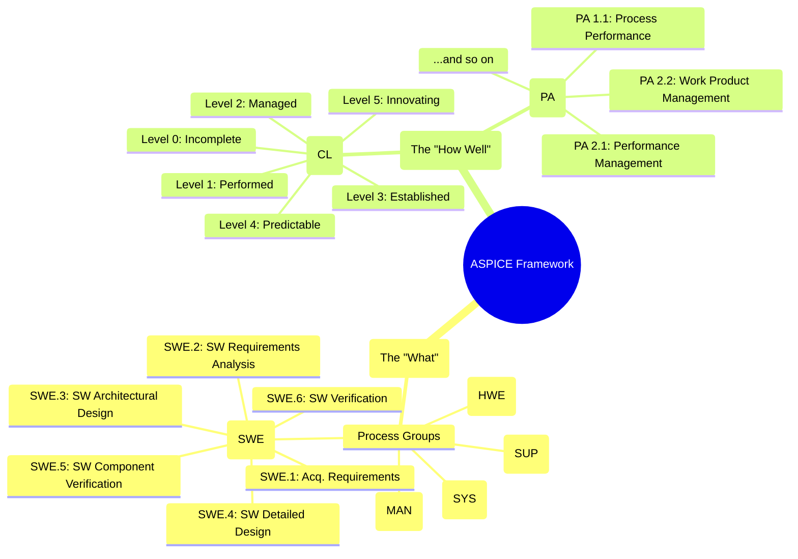
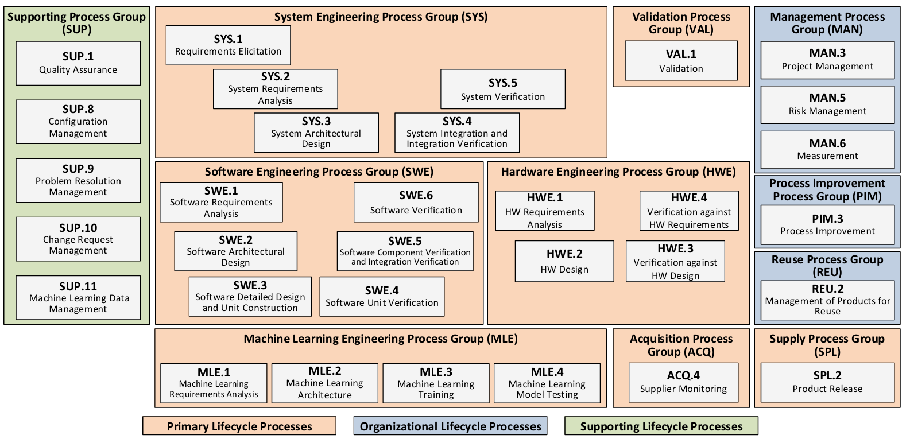
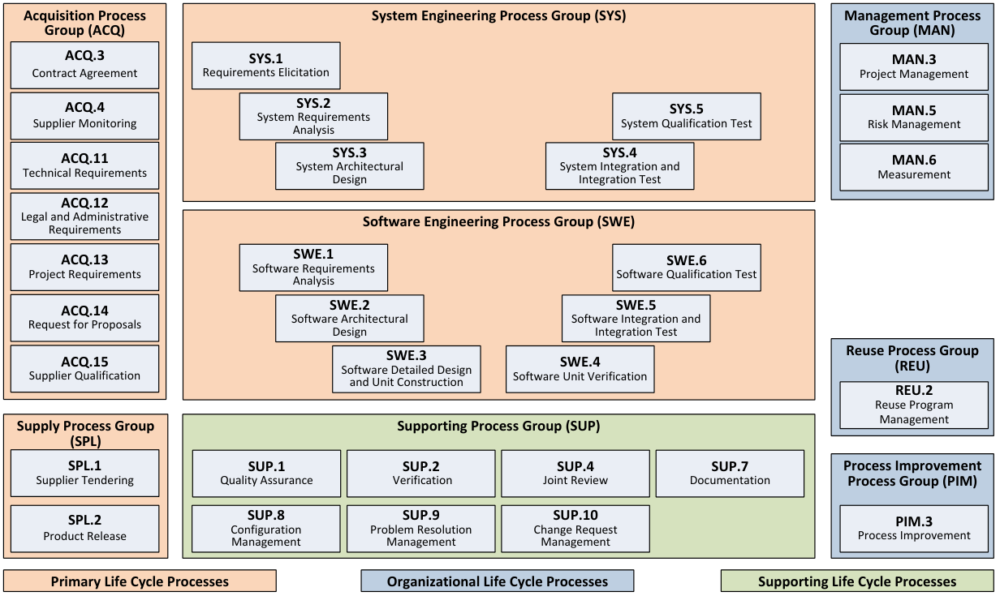
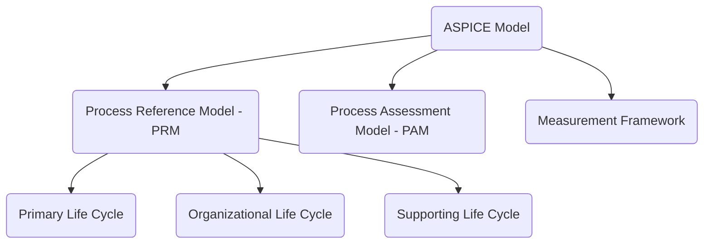
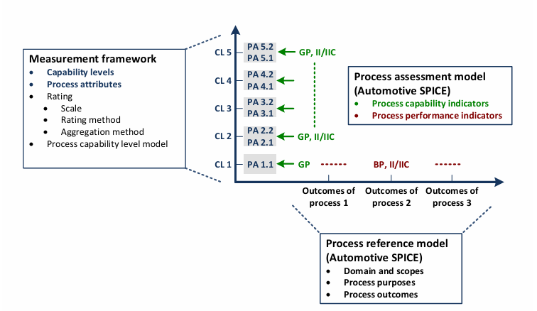
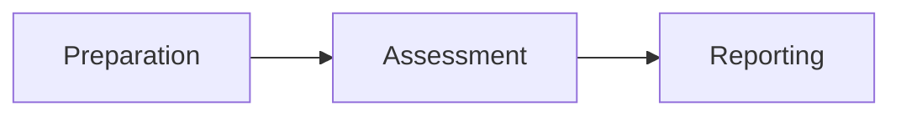
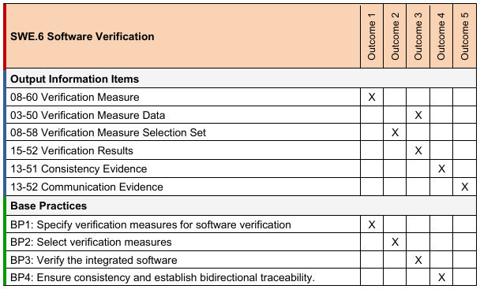

# 🚗 ASPICE: The Quality Recipe for Automotive Software

Welcome to the world of Automotive SPICE (ASPICE)! Think of it as the official, industry-standard **recipe book** for creating high-quality software for cars. Just like a master chef follows a detailed recipe to ensure every dish is perfect, automotive teams follow ASPICE processes to ensure their software is safe, reliable, and well-documented. It's not about *what* to build, but *how* to build it right.

This guide provides a concise overview of ASPICE 4.0, focusing on the key concepts and testing-related processes.

## 🔗 Related topics

- [Testing](../testing/testing.md) — the verification and validation mechanisms ASPICE evaluates
- [SDLC](../sdlc/sdlc.md) — the lifecycle context in which process capability is managed
- [CAN](../can/can.md) — automotive systems and bus behavior that must be engineered under quality processes
- [UDS](../uds/uds.md) — diagnostic workflows and ECU validation within the development process
- [Git](../git/git.md) — version-controlled work products and traceability across engineering activities

> **Disclaimer:**
> This document is AI-generated and intended for educational and reference purposes only. It is not an official ASPICE publication and should not be used as a substitute for the official ASPICE documentation or for formal assessments.

### 🗓️ Version Information

| ASPICE Version Referenced | Document Version |
|--------------------------|-----------------|
| 4.0 (with 3.1 comparisons) | 2025-06-27      |

## 🗺️ The ASPICE Framework at a Glance

This mindmap provides a high-level overview of the two dimensions that make up the ASPICE framework.

## 🏗️ ASPICE Model Structure

The ASPICE model is built on two main pillars: the **Process Reference Model (PRM)**, which defines *what* to do, and the **Process Assessment Model (PAM)**, which includes a framework for measuring *how well* you do it.

### 🗂️ Process Reference Model (PRM)

Processes are organized into three categories:

| Category                  | Description                                  |
|---------------------------|----------------------------------------------|
| Primary Life Cycle        | Core development and delivery activities     |
| Organizational Life Cycle | Management and organizational practices      |
| Supporting Life Cycle     | Supplementary/support functions              |

Each process has a **purpose statement** and **specific outcomes**.

| ASPICE 4.0 PRM | ASPICE 3.1 PRM |
|----------------|----------------|
|  |  |

#### 📊 Model Structure Overview

## 🧩 Assessment Process

How do you know if a team is following the recipe correctly? Through an assessment. This section briefly outlines how an ASPICE assessment works.

### Assessment Indicators vs Process Capability

| Visuals |
|---------|
|  |

### ASPICE Assessment Process Overview

| Step        | Description                                                                 |
|-------------|-----------------------------------------------------------------------------|
| Preparation | Define scope, select processes, gather documentation                        |
| Assessment  | Interview stakeholders, review evidence, rate process attributes            |
| Reporting   | Summarize findings, assign capability levels, recommend improvements        |

#### 🧭 Assessment Process Flow (Mermaid)

### 🧪 SWE.6 Software Verification

| Aspect   | Description                                                                                   |
|----------|----------------------------------------------------------------------------------------------|
| Purpose  | Ensure integrated software is verified against requirements                                  |
| Outcomes | Measures specified, verification performed, results recorded, traceability ensured           |

#### 🔍 Base Practices Comparison

| BP   | ASPICE 3.1 Description                        | ASPICE 4.0 Description                                 |
|------|-----------------------------------------------|--------------------------------------------------------|
| BP1  | Develop qualification test strategy            | Specify verification measures for software verification |
| BP2  | Develop qualification test specification       | Select verification measures                            |
| BP3  | Select test cases                             | Verify integrated software                              |
| BP4  | Test integrated software                      | Ensure consistency & establish bidirectional traceability|
| BP5  | Establish bidirectional traceability          | Summarize and communicate results                       |
| BP6  | Ensure consistency                            | *Merged into BP4*                                       |
| BP7  | Summarize and communicate results             | *Merged into BP5*                                       |

| Visuals |
|---------|
|  |

## 🚗 ASPICE in Practice: Developing a Lane Keep Assist Feature

All these processes and acronyms can feel very abstract. Let's make it concrete with a simplified example. Imagine we're on a team developing a "Lane Keep Assist" (LKA) feature. How would some of the key testing processes apply?

### SWE.5: Verifying the Software Components

*   **What it is:** This is where we test the individual "pieces" of our LKA software and how they fit together.
*   **In Practice:**
    *   **Component Verification:** We'd have a software component that reads camera data. We would write a unit test for the function `find_lane_markers(camera_image)` to ensure it correctly identifies lane lines in various test images (day, night, rain).
    *   **Integration Verification:** We would then test if the `camera_reader` component correctly sends its data to the `steering_controller` component. We're not testing the whole LKA system yet, just that these two pieces can talk to each other as designed.

### SWE.6: Verifying the Whole Software

*   **What it is:** Now we test the *entire* LKA software package after all the components have been integrated.
*   **In Practice:**
    *   We would run the complete LKA software on a test bench or in a simulation (like a SiL environment).
    *   We'd have test cases like: "Given a simulated straight road, verify the software commands a steering angle of 0 degrees." or "Given a simulated gentle curve, verify the software commands a correct steering adjustment."
    *   This is about verifying that the software as a whole meets its specified requirements.

### VAL.1: Validating the Feature in the Real World

*   **What it is:** This is the final step: proving that the feature actually works for the driver in a real car.
*   **In Practice:**
    *   We would install the LKA system in a real test vehicle.
    *   A test driver would take the car on a real highway and perform validation tests like: "The vehicle shall stay in the center of the lane for 10 km without driver intervention."
    *   This isn't just about meeting technical requirements; it's about validating that the feature meets the *user's* (the driver's) needs and is safe and effective in its intended environment.

## 🏁 Summary Table: Testing-Related ASPICE Processes

| Process | Purpose | Key Outcomes | Typical Work Products |
|---------|---------|--------------|----------------------|
| SWE.5   | Component & integration verification | Measures specified, integration performed, results recorded, traceability | Integration test strategy, test specs, test reports |
| SWE.6   | Software verification | Measures specified, verification performed, results recorded, traceability | Qualification test strategy, test specs, test reports |
| VAL.1   | Validation | Validation measures selected, validation performed, results recorded, traceability | Validation plan, validation reports |

## 📚 References

- [Automotive SPICE 4.0 Reference Manual (PDF)](https://vda-qmc.de/wp-content/uploads/2023/12/Automotive-SPICE-PAM-v40.pdf)
- [Automotive SPICE 4.0 Pocket Guide (PDF)](https://www.ul.com/sites/default/files/2024-10/Automotive_Spice_Pocket_Guide.pdf)
- [Official ASPICE Website](https://vda-qmc.de/en/automotive-spice/automotive-spice-veroeffentlichungen)

---

