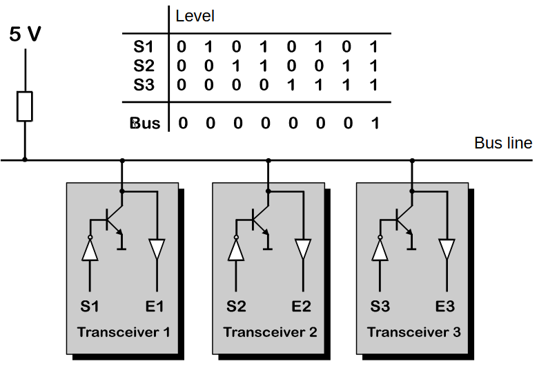
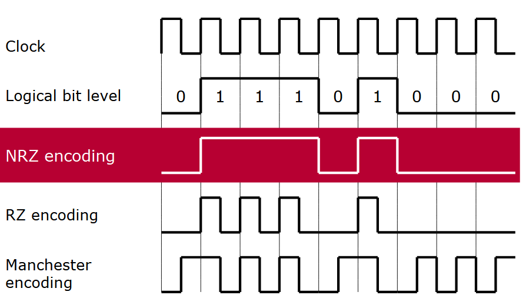
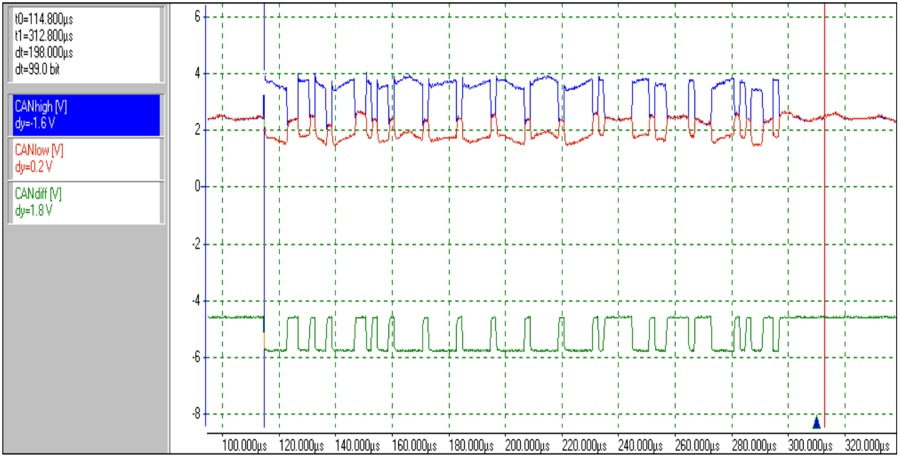

# 🔌 CAN Physical Layer

The physical layer defines how the bits are actually transmitted on the wires. CAN uses **Differential Signaling**, which is the secret sauce behind its noise immunity.

## ⚡ Differential Signaling
CAN uses two wires:
*   **CAN_H (High)**
*   **CAN_L (Low)**

The logic state is determined by the *difference* in voltage between these two wires ($V_{diff} = V_{CAN\_H} - V_{CAN\_L}$).

### Logic States
| State | Logic Value | Description | Voltage (Typical) |
| :--- | :--- | :--- | :--- |
| **Dominant** | **0** | "Active" state. Transceiver drives voltage difference. | CAN_H ≈ 3.5V CAN_L ≈ 1.5V Diff ≈ 2.0V |
| **Recessive** | **1** | "Idle" state. Bus is floating (weakly biased). | CAN_H ≈ 2.5V CAN_L ≈ 2.5V Diff ≈ 0V |

> **Analogy:** Think of "Dominant" as shouting and "Recessive" as whispering. If one person shouts and another whispers, you only hear the shout. A Dominant (0) bit always overwrites a Recessive (1) bit.

## 🔌 Termination
To prevent signal reflections (echoes) at the ends of the bus, the line must be terminated.
*   **Standard:** A **120Ω resistor** is placed between CAN_H and CAN_L at *each end* of the bus.
*   **Total Resistance:** Since there are two 120Ω resistors in parallel, the measured resistance across a healthy unpowered bus should be **60Ω**.

## 📉 Common Physical Faults
| Fault | Symptom | Result |
| :--- | :--- | :--- |
| **CAN_H Short to GND** | CAN_H stays at 0V. | No differential voltage. Bus dead. |
| **CAN_L Short to VBAT** | CAN_L stays at 12V. | Massive common mode voltage. Bus dead. |
| **Missing Termination** | Reflections, ringing edges. | Works on bench, fails in vehicle or with long cables. |
| **One Resistor Only** | 120Ω measured. | Might work, but reduced noise immunity. |

## 📏 Bus Length vs. Speed
The longer the bus, the slower you must go (due to propagation delay).
*   **1 Mbit/s:** ~40 meters
*   **500 kbit/s:** ~100 meters
*   **125 kbit/s:** ~500 meters

