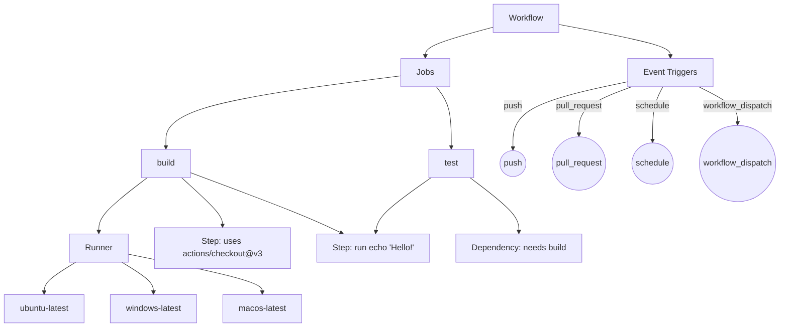

# 🤖 GitHub Actions: Your Personal CI/CD Robot

Automate your builds, tests, and deployments with GitHub Actions—a powerful CI/CD tool built into GitHub. This guide introduces the essentials and walks you through creating your first workflow.

---

## 📑 Table of Contents

1. [What is GitHub Actions?](#-what-is-github-actions-and-why-should-i-use-it)
2. [Ecosystem Overview](#-the-github-actions-ecosystem-a-birds-eye-view)
3. [Core Concepts](#-the-building-blocks-core-concepts-explained)
4. [Step-by-Step Tutorial](#-your-first-workflow-a-step-by-step-tutorial)
5. [Practical Examples](#-practical-examples)
6. [Key Features & Advanced Concepts](#-key-features--advanced-concepts)
7. [Best Practices](#-best-practices)
8. [Further Reading](#-further-reading)

---

## 🤔 What is GitHub Actions and Why Should I Use It?

**GitHub Actions** is a **CI/CD (Continuous Integration/Continuous Delivery)** platform for automating software workflows. Define commands in YAML, and GitHub runs them on virtual machines ("runners") in response to repository events (push, pull request, etc).

**Why use it?**
- **Automation:** Build and test code automatically to catch bugs early.
- **Consistency:** Run tests in a clean, repeatable environment.
- **Integration:** Seamless with GitHub code, pull requests, and deployments.
- **Community Power:** Use pre-built actions for complex tasks in one line.

---

## 🧠 The GitHub Actions Ecosystem: A Bird's-Eye View

Workflows are built from a few key concepts. The mindmap below shows their relationships:



---

## 🧩 The Building Blocks: Core Concepts Explained

Before building a workflow, learn these key terms:

- **Workflow:** The entire automated process, defined in a YAML file.
- **Event:** Activity that triggers a workflow (e.g., `push`, `pull_request`).
- **Job:** A set of steps running on the same runner. Jobs can run in parallel or depend on each other.
- **Runner:** The VM that executes jobs (`ubuntu-latest`, `windows-latest`, `macos-latest`).
- **Step:** An individual task in a job (shell command or Action).
- **Action:** A reusable package for common tasks (e.g., `actions/checkout`).

---

## 🚀 Your First Workflow: A Step-by-Step Tutorial

Let's create a simple workflow that prints "Hello, World!" on every push.

**Step 1: Create the Workflow Directory**

GitHub Actions looks for workflow files in `.github/workflows`:

```text
my-project/
└── .github/
    └── workflows/
```

**Step 2: Create the Workflow File**

Create `hello-world.yml` in the `workflows` directory.

**Step 3: Write the Workflow Code**

Paste this into `hello-world.yml`:

```yaml
name: Hello World Workflow
on: [push]
jobs:
  say-hello:
    runs-on: ubuntu-latest
    steps:
      - name: Greet the user
        run: echo "Hello, World! Thanks for triggering me."
      - name: Show the current directory
        run: ls -la
```

**Step 4: Commit and Push**

```bash
git add .github/workflows/hello-world.yml
git commit -m "Add my first GitHub Actions workflow"
git push
```

**Step 5: See it in Action!**

Go to your repo's **Actions** tab to view the workflow run and output.

---

## 💡 Practical Examples

### Parallel and Matrix Execution Examples

**1. Basic Parallel Jobs**
Jobs in a workflow run in parallel by default:
```yaml
name: Parallel Jobs Example
on: [push]
jobs:
  build:
    runs-on: windows-latest
    steps:
      - run: echo "Building on Windows..."
  build-linux:
    runs-on: ubuntu-latest
    steps:
      - run: echo "Building on Linux..."
  test:
    runs-on: windows-latest
    steps:
      - run: echo "Testing on Windows..."
  test-linux:
    runs-on: ubuntu-latest
    steps:
      - run: echo "Testing on Linux..."
```

### Build and Compilation Automation

#### C++ and CMake Projects

**Cross-platform builds with matrix strategy:**
```yaml
name: C++ Cross-Platform Build
on: [push, pull_request]
jobs:
  build:
    strategy:
      matrix:
        os: [windows-latest, ubuntu-latest]
        compiler: [gcc, clang, msvc]
    runs-on: ${{ matrix.os }}
    steps:
      - uses: actions/checkout@v3
      - name: Set up compiler
        run: echo "Compiler: ${{ matrix.compiler }}"
      - name: Configure with CMake presets
        run: cmake --preset=default
      - name: Build
        run: cmake --build --preset=default
```

**C++ build using Docker in GitHub Actions:**
```yaml
name: C++ Docker Build
on: [push]
jobs:
  build:
    runs-on: ubuntu-latest
    steps:
      - uses: actions/checkout@v3
      - name: Build in Docker
        run: |
          docker build -t cpp-build-env -f Dockerfile .
          docker run --rm -v ${{ github.workspace }}:/workspace -w /workspace cpp-build-env bash -c "cmake -S . -B build && cmake --build build --config Release"
```

Example `Dockerfile` for a C++ build environment:
```Dockerfile
FROM ubuntu:22.04
RUN apt-get update && \
    apt-get install -y build-essential cmake git && \
    rm -rf /var/lib/apt/lists/*
WORKDIR /workspace
```

#### Python Projects

**Multi-version Python testing (3.8–3.12):**
```yaml
name: Python Multi-Version CI
on: [push, pull_request]
jobs:
  test-windows:
    runs-on: windows-latest
    strategy:
      matrix:
        python-version: ["3.8", "3.9", "3.10", "3.11", "3.12"]
    steps:
      - uses: actions/checkout@v3
      - uses: actions/setup-python@v3
        with:
          python-version: ${{ matrix.python-version }}
      - run: pip install -r requirements.txt
      - run: pytest
  test-linux:
    runs-on: ubuntu-latest
    strategy:
      matrix:
        python-version: ["3.8", "3.9", "3.10", "3.11", "3.12"]
    steps:
      - uses: actions/checkout@v3
      - uses: actions/setup-python@v3
        with:
          python-version: ${{ matrix.python-version }}
      - run: pip install -r requirements.txt
      - run: pytest
```

**Package building and distribution to PyPI:**
```yaml
name: Python Publish to PyPI
on:
  push:
    tags:
      - 'v*'
jobs:
  build-and-publish-windows:
    runs-on: windows-latest
    steps:
      - uses: actions/checkout@v3
      - uses: actions/setup-python@v3
        with:
          python-version: '3.10'
      - run: pip install build twine
      - run: python -m build
      - run: twine upload dist/*
        env:
          TWINE_USERNAME: ${{ secrets.PYPI_USERNAME }}
          TWINE_PASSWORD: ${{ secrets.PYPI_PASSWORD }}
  build-and-publish-linux:
    runs-on: ubuntu-latest
    steps:
      - uses: actions/checkout@v3
      - uses: actions/setup-python@v3
        with:
          python-version: '3.10'
      - run: pip install build twine
      - run: python -m build
      - run: twine upload dist/*
        env:
          TWINE_USERNAME: ${{ secrets.PYPI_USERNAME }}
          TWINE_PASSWORD: ${{ secrets.PYPI_PASSWORD }}
```

**Virtual environment management with poetry:**
```yaml
name: Python Poetry CI
on: [push]
jobs:
  test-windows:
    runs-on: windows-latest
    steps:
      - uses: actions/checkout@v3
      - uses: actions/setup-python@v3
        with:
          python-version: '3.10'
      - run: pip install poetry
      - run: poetry install
      - run: poetry run pytest
  test-linux:
    runs-on: ubuntu-latest
    steps:
      - uses: actions/checkout@v3
      - uses: actions/setup-python@v3
        with:
          python-version: '3.10'
      - run: pip install poetry
      - run: poetry install
      - run: poetry run pytest
```

**Wheel and source distribution creation:**
```yaml
name: Python Build Wheels
on: [push]
jobs:
  build-windows:
    runs-on: windows-latest
    steps:
      - uses: actions/checkout@v3
      - uses: actions/setup-python@v3
        with:
          python-version: '3.10'
      - run: pip install build
      - run: python -m build
      - name: Upload wheels
        uses: actions/upload-artifact@v3
        with:
          name: wheels
          path: dist/
  build-linux:
    runs-on: ubuntu-latest
    steps:
      - uses: actions/checkout@v3
      - uses: actions/setup-python@v3
        with:
          python-version: '3.10'
      - run: pip install build
      - run: python -m build
      - name: Upload wheels
        uses: actions/upload-artifact@v3
        with:
          name: wheels
          path: dist/
```

### Testing and Quality Assurance

**Integration testing with database containers:**
```yaml
name: Python Integration Test with PostgreSQL
on: [push]
jobs:
  test-windows:
    runs-on: windows-latest
    services:
      postgres:
        image: postgres:13
        ports:
          - 5432:5432
        env:
          POSTGRES_USER: test
          POSTGRES_PASSWORD: test
          POSTGRES_DB: testdb
    steps:
      - uses: actions/checkout@v3
      - uses: actions/setup-python@v3
        with:
          python-version: '3.10'
      - run: pip install -r requirements.txt
      - run: pytest
  test-linux:
    runs-on: ubuntu-latest
    services:
      postgres:
        image: postgres:13
        ports:
          - 5432:5432
        env:
          POSTGRES_USER: test
          POSTGRES_PASSWORD: test
          POSTGRES_DB: testdb
    steps:
      - uses: actions/checkout@v3
      - uses: actions/setup-python@v3
        with:
          python-version: '3.10'
      - run: pip install -r requirements.txt
      - run: pytest
```

**Coverage reporting with threshold enforcement:**
```yaml
name: Python Coverage Enforcement
on: [push]
jobs:
  coverage-windows:
    runs-on: windows-latest
    steps:
      - uses: actions/checkout@v3
      - uses: actions/setup-python@v3
        with:
          python-version: '3.10'
      - run: pip install coverage
      - run: coverage run -m pytest
      - run: coverage report --fail-under=80
  coverage-linux:
    runs-on: ubuntu-latest
    steps:
      - uses: actions/checkout@v3
      - uses: actions/setup-python@v3
        with:
          python-version: '3.10'
      - run: pip install coverage
      - run: coverage run -m pytest
      - run: coverage report --fail-under=80
```

**Quality gate enforcement for C++:**
```yaml
name: C++ Coverage Gate
on: [push]
jobs:
  coverage-windows:
    runs-on: windows-latest
    steps:
      - uses: actions/checkout@v3
      - name: Build and run tests with coverage
        run: |
          cmake -S . -B build -DCMAKE_BUILD_TYPE=Release -DENABLE_COVERAGE=ON
          cmake --build build --config Release
          .\build\Release\your_gtest_executable.exe --gtest_output=xml:test_results.xml
      - name: Enforce coverage threshold
        run: echo "Implement coverage threshold enforcement with your tool"
  coverage-linux:
    runs-on: ubuntu-latest
    steps:
      - uses: actions/checkout@v3
      - name: Build and run tests with coverage
        run: |
          cmake -S . -B build -DCMAKE_BUILD_TYPE=Release -DENABLE_COVERAGE=ON
          cmake --build build --config Release
          ./build/your_gtest_executable --gtest_output=xml:test_results.xml
      - name: Enforce coverage threshold
        run: echo "Implement coverage threshold enforcement with your tool"
```

### Continuous Integration Workflows

**Static analysis integration for code quality enforcement:**
```yaml
name: Python Static Analysis
on: [push]
jobs:
  analyze-windows:
    runs-on: windows-latest
    steps:
      - uses: actions/checkout@v3
      - uses: actions/setup-python@v3
        with:
          python-version: '3.10'
      - run: pip install pylint
      - run: pylint your_module/
  analyze-linux:
    runs-on: ubuntu-latest
    steps:
      - uses: actions/checkout@v3
      - uses: actions/setup-python@v3
        with:
          python-version: '3.10'
      - run: pip install pylint
      - run: pylint your_module/
```

**Dependency security scanning:**
```yaml
name: Python Dependency Security
on: [push]
jobs:
  security-windows:
    runs-on: windows-latest
    steps:
      - uses: actions/checkout@v3
      - uses: actions/setup-python@v3
        with:
          python-version: '3.10'
      - run: pip install safety
      - run: safety check
  security-linux:
    runs-on: ubuntu-latest
    steps:
      - uses: actions/checkout@v3
      - uses: actions/setup-python@v3
        with:
          python-version: '3.10'
      - run: pip install safety
      - run: safety check
```

**Matrix builds for multi-environment testing:**
```yaml
name: Python Multi-Env Matrix
on: [push]
jobs:
  test:
    strategy:
      matrix:
        os: [windows-latest, ubuntu-latest]
        python-version: ["3.8", "3.9", "3.10"]
    runs-on: ${{ matrix.os }}
    steps:
      - uses: actions/checkout@v3
      - uses: actions/setup-python@v3
        with:
          python-version: ${{ matrix.python-version }}
      - run: pip install -r requirements.txt
      - run: pytest
```

### Deployment and Release Management

**GitHub Pages deployment for documentation:**
```yaml
name: Deploy Docs to GitHub Pages
on:
  push:
    branches: [main]
jobs:
  deploy-windows:
    runs-on: windows-latest
    steps:
      - uses: actions/checkout@v3
      - name: Build docs
        run: python -m mkdocs build
      - name: Deploy
        uses: peaceiris/actions-gh-pages@v4
        with:
          github_token: ${{ secrets.GITHUB_TOKEN }}
          publish_dir: site
  deploy-linux:
    runs-on: ubuntu-latest
    steps:
      - uses: actions/checkout@v3
      - name: Build docs
        run: python -m mkdocs build
      - name: Deploy
        uses: peaceiris/actions-gh-pages@v4
        with:
          github_token: ${{ secrets.GITHUB_TOKEN }}
          publish_dir: site
```

**Semantic versioning and changelog generation:**
```yaml
name: Release Automation
on:
  push:
    tags:
      - 'v*'
jobs:
  release-windows:
    runs-on: windows-latest
    steps:
      - uses: actions/checkout@v3
      - name: Generate changelog
        uses: mikepenz/release-changelog-builder-action@v3
      - name: Create GitHub Release
        uses: softprops/action-gh-release@v1
        with:
          tag_name: ${{ github.ref }}
  release-linux:
    runs-on: ubuntu-latest
    steps:
      - uses: actions/checkout@v3
      - name: Generate changelog
        uses: mikepenz/release-changelog-builder-action@v3
      - name: Create GitHub Release
        uses: softprops/action-gh-release@v1
        with:
          tag_name: ${{ github.ref }}
```

**Deployment approval workflow with manual gates:**
```yaml
name: Manual Approval for Production
on:
  workflow_dispatch:
jobs:
  deploy-windows:
    runs-on: windows-latest
    steps:
      - uses: actions/checkout@v3
      - name: Build and deploy
        run: echo "Deploying to production..."
    environment:
      name: production
      url: https://your-production-url.com
      reviewers:
        - your-github-username
  deploy-linux:
    runs-on: ubuntu-latest
    steps:
      - uses: actions/checkout@v3
      - name: Build and deploy
        run: echo "Deploying to production..."
    environment:
      name: production
      url: https://your-production-url.com
      reviewers:
        - your-github-username
```

---

## 🏆 Best Practices

- **Start Simple:** Begin with a basic workflow and add complexity gradually.
- **Use Community Actions:** 🛒 Leverage actions from the Marketplace for common tasks.
- **Pin Actions to a Version:** 📌 Use specific version hashes (e.g., `actions/checkout@v3`) to avoid unexpected changes.
- **Use Secrets:** 🔒 Never hardcode sensitive data in workflow files.
- **Review Workflow Permissions:** 🔍 Limit permissions to only what's needed for security.
- **Cache Dependencies:** 🚀 Speed up builds by caching dependencies and build outputs.
- **Test Locally:** 🧪 Use tools like `act` to test workflows before pushing.
- **Document Workflows:** 📚 Add comments and documentation for maintainability.
- **Monitor Workflow Runs:** 👀 Regularly check the Actions tab for failures and optimize as needed.

---

## 🔗 Further Reading

- [Official GitHub Actions Documentation](https://docs.github.com/en/actions)
- [GitHub Actions Marketplace](https://github.com/marketplace?type=actions)

---

## 📝 Summary

GitHub Actions makes automation easy and powerful. Start simple, use community actions, and follow best practices for secure, reliable workflows.
