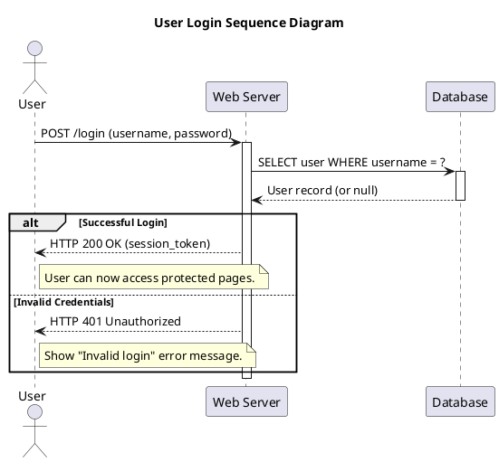

# 🌱 PlantUML: The "Draw with Text" Wizard

PlantUML is like that friend who can sketch your entire system architecture on a napkin while you're still looking for a pen. It turns simple text into professional diagrams. No mouse dragging required. 🎨

## 🔗 Related topics

- [Integration](../integration/integration.md) — architecture and workflow documentation is often created alongside CI/CD tooling
- [Git](../git/git.md) — diagrams can live alongside version-controlled system and design artifacts
- [YAML](../yaml/yaml.md) — config-driven workflows and architecture descriptions often complement one another
- [Testing](../testing/testing.md) — test architecture and flow diagrams improve communication and verification clarity
- [SDLC](../sdlc/sdlc.md) — documentation of system structure and process flow supports the lifecycle

## ⚡ Quick Start (Copy-Paste-Run)

1. **Download** `plantuml.jar` from [plantuml.com](https://plantuml.com/download).
2. **Write** a text file (e.g., `diagram.puml`).
3. **Run**: `java -jar plantuml.jar diagram.puml`
4. **Profit**: You get a `.png` image.

## 🚀 Your First Diagram: The Login Flow

Let's model a real-world login scenario. We'll use a **Sequence Diagram** because it's the best way to show "who said what to whom and when".

### The Code (`examples/sequence_login.puml`)

[View File](examples/sequence_login.puml)



### 💡 Pro Tips
- `participant`: Defines the columns.
- `->`: Message sent.
- `-->`: Reply sent.
- `alt/else`: If/Else logic for diagrams.

## 🔌 Integrations (Where to write this stuff)

| Tool | How |
|------|-----|
| **VS Code** | Install the "PlantUML" extension by Jebbs. It's awesome. |
| **IntelliJ** | Built-in or plugin. |
| **Markdown** | Many tools (like GitHub/GitLab) render these blocks automatically. |

## 🔗 References

- [Official Docs](https://plantuml.com/) - The bible.
- [Real World PlantUML](https://real-world-plantuml.com/) - Inspiration.
```


