# 🌱 PlantUML

PlantUML is an open-source tool that lets you create diagrams from simple text!
It's perfect for making UML and other diagrams in docs, wikis, and codebases. 🎨

---

## 🚀 Prerequisites

| Requirement | Details |
|-------------|---------|
| **☕ Java**  | Java 8 or higher is required.<br>Check with:<br> <code>java -version</code><br>If not installed, download from [Adoptium](https://adoptium.net/) or [Oracle](https://www.oracle.com/java/technologies/downloads/). |

---

## ⚡ Quick Start

1. **Download** the latest `plantuml.jar` from the [official website](https://plantuml.com/download).
2. **Create** a `.puml` file with your diagram text.
3. **Generate** an image:
   ```bash
   java -jar plantuml.jar diagram.puml
   ```
   🖼️ You'll get a shiny `.png` file in the same folder!

---

## 🧩 Core Concepts: The `@startuml` Block

Every PlantUML diagram lives inside a `@startuml` and `@enduml` block. This is how the `plantuml.jar` tool knows where your diagram definition begins and ends.

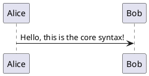

Inside this block, you use PlantUML's simple language to define your diagram.

---

## 🚀 Your First Diagram: Modeling a Login Flow

Let's create a real-world example: a **sequence diagram** that shows the steps involved when a user logs into a system. This is one of the most useful diagrams for software developers.

### Step 1: Define the Participants

First, we define who (or what) is involved in the interaction. We have a `User`, a `WebServer`, and a `Database`.

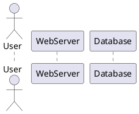

### Step 2: Show the Initial Request

The User sends their credentials (username, password) to the WebServer. We use `->` to show a one-way message.

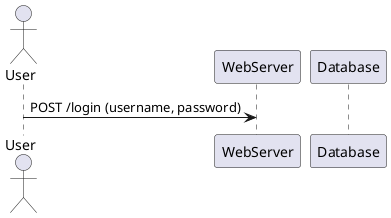

### Step 3: Add Internal Communication and a Return Path

The WebServer needs to check the credentials against the Database. It sends a query and gets a response. We use `-->` for return messages.

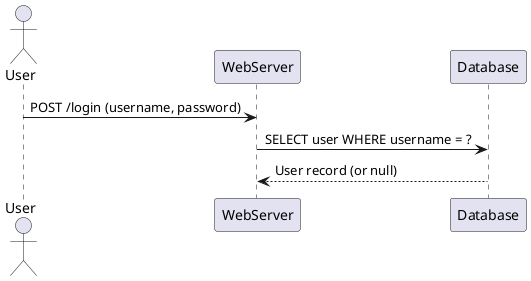

### Step 4: Group Steps and Show Conditional Logic

What if the login is successful? We can group these steps inside a `group` block.

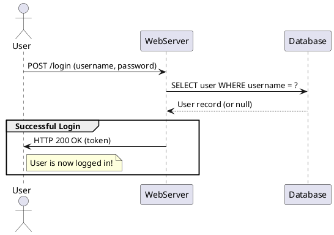
*   `group`: Creates a box around a set of interactions.
*   `note right of User`: Adds a comment to the side of a participant.

### Final Diagram

Putting it all together, here is our complete, easy-to-read sequence diagram for a login flow!

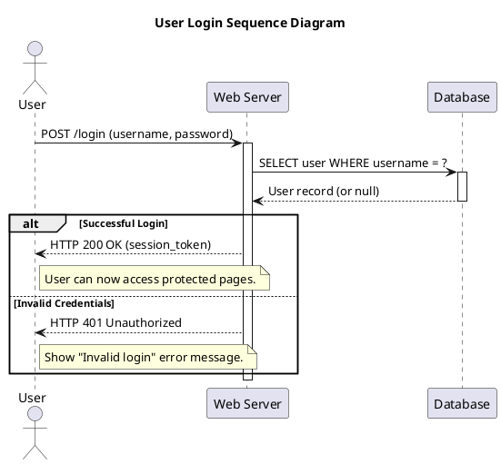
*   `title`: Adds a title to the diagram.
*   `"User" as user`: Creates an alias for a participant for easier reference.
*   `activate`/`deactivate`: Shows the lifespan of a process (when it's "active").
*   `alt`/`else`/`end`: Shows alternative flows (like a success case vs. an error case).

This tutorial provides a much more practical and in-depth example than the simple snippets in the gallery.

---

## 🖼️ Diagram Gallery: A Tour of Possibilities

Check out this gallery of cool diagrams you can make with PlantUML. The possibilities are endless!

<details>
<summary>🕒 Sequence Diagram</summary>

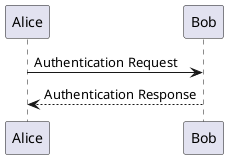
</details>

<details>
<summary>🎭 Use Case Diagram</summary>

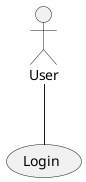
</details>

<details>
<summary>🏷️ Class Diagram</summary>

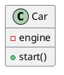
</details>

<details>
<summary>🧑‍🤝‍🧑 Object Diagram</summary>

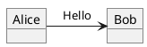
</details>

<details>
<summary>🏃 Activity Diagram</summary>

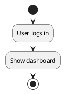
</details>

<details>
<summary>🧩 Component Diagram</summary>

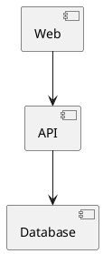
</details>

<details>
<summary>🖥️ Deployment Diagram</summary>

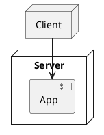
</details>

<details>
<summary>🔄 State Diagram</summary>

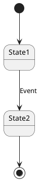
</details>

<details>
<summary>⏱️ Timing Diagram</summary>

```plantuml
@startuml
robust "User" as U
robust "System" as S
U -> S : Request
S -> U : Response
@enduml
```
</details>

<details>
<summary>📅 Gantt Chart</summary>

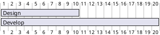
</details>

<details>
<summary>🧠 Mindmap Diagram</summary>

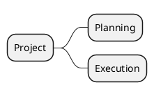
</details>

<details>
<summary>🪜 WBS Diagram</summary>

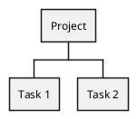
</details>

<details>
<summary>🗂️ ER Diagram</summary>

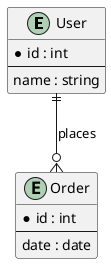
</details>

<details>
<summary>📦 JSON Data Diagram</summary>

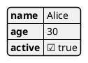
</details>

<details>
<summary>🔍 Regex Diagram</summary>

```plantuml
@startuml
:/(ab|cd)+/;
@enduml
```
</details>

<details>
<summary>🌐 Network Diagram (nwdiag)</summary>

```plantuml
@startnwdiag
network dmz {
  web;
  db;
}
@endnwdiag
```
</details>

<details>
<summary>🖥️ UI Mockup (salt)</summary>

```plantuml
@startsalt
{
  Button "OK"
  Button "Cancel"
}
@endsalt
```
</details>

---

## 📁 File Structure

Organize your PlantUML files like this:

```
project/
└── diagrams/
    ├── example1.puml
    └── example2.puml
```

---

## 🔌 Integrations

PlantUML works with lots of tools and editors! 🚀

| Tool/Editor         | Integration Method/Extension                |
|---------------------|--------------------------------------------|
| 📝 VS Code          | PlantUML extension                         |
| 💡 IntelliJ IDEA    | PlantUML integration/plugin                |
| 🐘 Eclipse          | PlantUML plugin                            |
| 🗒️ Markdown editors | Direct embedding or plugin support         |
| ⚙️ CI/CD pipelines   | Automated diagram generation               |

See [PlantUML integrations](https://plantuml.com/running) for more.

---

## 🛠️ Troubleshooting

| Issue                        | Solution                                              |
|------------------------------|------------------------------------------------------|
| ❌ `java` not found           | Make sure Java is installed and on your PATH.         |
| 🖼️ No image generated         | Check for errors in your `.puml` file syntax.         |
| 📂 Output file not found      | Run the command in the correct directory.             |

---

## 📜 License

PlantUML is distributed under the [GPL, LGPL, or EPL license](https://plantuml.com/license).
Please review the license terms before using in commercial projects.

---

## 🤝 Support & Contributing

- For questions, visit the [PlantUML Q&A](https://forum.plantuml.net/).
- Contributions welcome via the [official GitHub repo](https://github.com/plantuml/plantuml)! 🎉

---

## 🔗 References

- [🌱 PlantUML Official Website](https://plantuml.com/)
- [📖 PlantUML Language Reference Guide](https://plantuml.com/guide)
```
