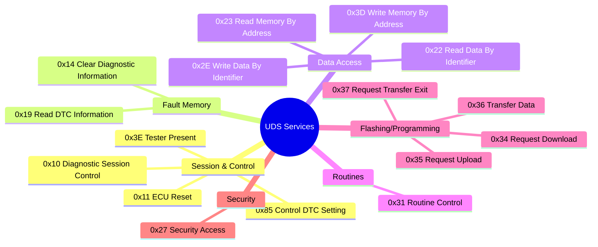

# 🚗 UDS: The Secret Language of Car Diagnostics

UDS (Unified Diagnostic Services, ISO 14229) is how diagnostic tools and ECUs have actual conversations. If CAN is the highway and DoIP is the postal service, then UDS is the **language** everyone speaks. It's a standardized set of "questions and answers" that work across all modern vehicles, regardless of manufacturer.

This guide will make you fluent in UDS—from reading fault codes to flashing software.

## 🔗 Related topics

- [CAN](../can/can.md) — the lower-layer bus protocol UDS runs on
- [DoIP](../doip/doip.md) — Ethernet-based diagnostics and flashing transport
- [Intrusion Detection System](../projects/IDS/IDS.md) — security monitoring around diagnostics and traffic
- [Testing](../testing/testing.md) — validation of diagnostics, faults, and regressions
- [Vector CAPL](../vector_capl/vector_capl.md) — simulate and validate CAN/diagnostic behavior

## 🗺️ UDS Services Map

UDS is organized into services (like API endpoints). Here's the landscape:

## 📖 Service Documentation

We've created detailed guides for each major UDS service. Click to learn more:

### Session & Control
- **[0x10 Diagnostic Session Control](services/0x10_diagnostic_session_control.md)** - Unlock different diagnostic modes
- **[0x11 ECU Reset](services/0x11_ecu_reset.md)** - Reboot the ECU
- **[0x3E Tester Present](services/0x3e_tester_present.md)** - Keep session alive (heartbeat)
- **[0x85 Control DTC Setting](services/0x85_control_dtc_setting.md)** - Enable/disable fault recording

### Fault Memory (DTCs)
- **[0x19 Read DTC Information](services/0x19_read_dtc_information.md)** - Read fault codes and freeze frames
- **[0x14 Clear Diagnostic Information](services/0x14_clear_diagnostic_information.md)** - Clear fault codes

### Data Access
- **[0x22 Read Data By Identifier](services/0x22_read_data_by_identifier.md)** - Read structured data (VIN, sensor values, etc.)
- **[0x2E Write Data By Identifier](services/0x2e_write_data_by_identifier.md)** - Write configuration/calibration
- **[0x23 Read Memory By Address](services/0x23_read_memory_by_address.md)** - Direct memory reading
- **[0x3D Write Memory By Address](services/0x3d_write_memory_by_address.md)** - Direct memory writing (dangerous!)

### Routines & Testing
- **[0x31 Routine Control](services/0x31_routine_control.md)** - Run ECU self-tests and procedures

### Programming/Flashing
- **[0x34 Request Download](services/0x34_request_download.md)** - Initiate software download to ECU
- **[0x35 Request Upload](services/0x35_request_upload.md)** - Initiate software upload from ECU  
- **[0x36 Transfer Data](services/0x36_transfer_data.md)** - Transfer data chunks
- **[0x37 Request Transfer Exit](services/0x37_request_transfer_exit.md)** - Finalize transfer

### Security
- **[0x27 Security Access](services/0x27_security_access.md)** - Unlock protected operations (seed-key challenge)

## 🏅 Best Practices

- **Check for negative responses:** Don't assume success. A `7F` response means "something went wrong"—read the NRC!
- **Security is key:** Many operations (writing calibration, clearing DTCs, flashing) require security unlock via 0x27.
- **Know your sessions:** Default session is limited. Extended session unlocks advanced diagnostics. Programming session is for flashing.
- **Keep sessions alive:** Send 0x3E TesterPresent every 2-3 seconds to prevent timeout.

---

## 📚 Further Reading

- [ISO 14229-1:2020](https://www.iso.org/standard/72439.html) (Official UDS standard)
- [UDS on Wikipedia](https://en.wikipedia.org/wiki/Unified_Diagnostic_Services)

