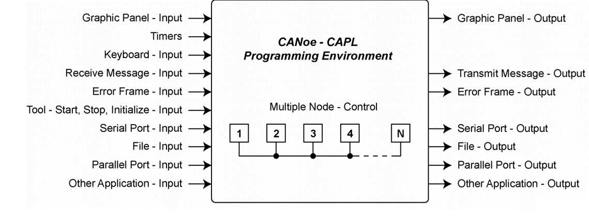

# CAPL Scripting Tutorial

## 1. Prerequisites
- Knowledge of Vector CANoe tool
- Basic knowledge of the C programming language
- Knowledge of database and bus protocols (minimum CAN)
- Windows PC with minimum 8GB RAM
- Vector CANoe version (>= 11.0) installed (demo version is sufficient)
- Download latest Vector CANoe demo version from [Vector](https://www.vector.com/int/en/download/canoe-demo-17-windows/)

## 2. Programming Environment
CAPL programming is performed in Vector CANoe and CANalyzer environments:
| Tool      | Programming Environment Image                                      |
| --------- | ------------------------------------------------------------------ |
| CANoe     |          |
| CANalyzer |  |

---

## 3. Introduction
- Communication Access Programming Language (CAPL) allows programming of network node models as well as special evaluation programs for individual applications.
- The functional range of CANoe includes a CAPL compiler which compiles a created CAPL file with the extension *.CAN to an executable program file with the extension *.CBF.
- CAPL programs can be used to analyze/simulate network data.
- CAPL program can be used to simulate the rest of the network.
- CAPL program can be used to automate test cases.

## 4. Basic Syntax
- Scripts are written in `.can` or `.capl` files.
- Each statement ends with a semicolon `;`.
- Comments start with `//` for single-line or `/* ... */` for multi-line.

**Use Case 1:** Send a CAN message on startup.
```capl
on start {
  message CAN1.Tx.MyMsg { // Send message MyMsg on CAN1
    dlc = 8;
    data[0] = 0x01;
    data[1] = 0x02;
    // ...
  }
}
```
**Use Case 2:** Schedule periodic transmission using timers.
```capl
msTimer periodicTx;
on start {
  setTimer(periodicTx, 100);
}
on timer periodicTx {
  output(CAN1.Tx.MyMsg);
  setTimer(periodicTx, 100);
}
```

## 5. Data Types and Variables
### Scalar Data Types
#### Integers
```capl
byte day;      // unsigned, 1 Byte
word month;    // unsigned, 2 Byte
dword year;    // unsigned, 4 Byte
int angle;     // signed, 2 Byte
long profit;   // signed, 4 Byte
int64 ticks;   // signed, 8 Byte
qword ts;      // unsigned, 8 Byte
```
#### Character
```capl
char key_pressed;
```
#### Floating Point
```capl
float pi_value = 3.14;
double stock_value = 5.123456;
```
### Structures
```capl
variables {
    struct PairStructType { int first; int second; } pair;
    struct PairStructType pair2;
}
on start {
    pair.first = 1;
    pair.second = 2;
}
```
### Enumeration Types
```capl
enum Colors { Red, Green, Blue };
```
### Associative Fields (Maps)
```capl
int m[float];         // maps float to int
float x[int64];       // maps int64 to float
char[30] s[char[]];   // maps string to string
```
### Objects
- message, multiplexed_message
- signal
- sysVar, sysVarInt, sysVarFloat, sysVarString, sysVarIntArray, sysVarFloatArray, sysVarData
- timer, msTimer
- diagRequest, diagResponse
### Global Variables
- Declared in the Variables section
- Data types: DWORD, LONG, WORD, INT, BYTE, CHAR, FLOAT, DOUBLE
- Timers: created with timer/msTimer, started with setTimer, stopped with cancelTimer
- CAN messages: declared with message
- Variables can be initialized in their declarations
### Local Variables
- Created statically in CAPL
- Initialization only at program start
- Retain value between procedure calls
```capl
variables {
    int j, k = 2;
    double f = 17.5;
    msTimer tmr;
    message 100 msg;
    int array_var[2] = {1, 2};
    char name[12] = "hello world";
    int array_matrix[2][2] = {{1, 2}, {3, 4}};
}
```
---

## 6. Functions
### User Defined Functions
Functions are defined using C-like syntax. Parameters and return values are supported.
```capl
void dummy_user_func() {
    int var_1 = 10;
    write("hello from user function. var_1 = %d", var_1);
}
void dummy_user_func_with_params(int var_1) {
    write("hello from user function. var_1 = %d", var_1);
}
int dummy_user_func_with_params_and_return(int var_1) {
    write("hello from user function. var_1 = %d", var_1);
    return var_1*10;
}
```
**Use Case 1:** Custom checksum calculation for CAN payload.
```capl
int calcChecksum(byte data[], int len) {
  int sum = 0;
  for (int i = 0; i < len; i++) {
    sum += data[i];
  }
  return (sum & 0xFF);
}
```
**Use Case 2:** Modular message builder.
```capl
void buildAndSendMsg(int id, byte payload[], int len) {
  message CAN1.Tx.CustomMsg {
    id = id;
    dlc = len;
    for (int i = 0; i < len; i++) {
      data[i] = payload[i];
    }
  }
}
```

## 7. Input/Output
- Use `write()` for console output.
- Use `output()` to send CAN messages.
**Use Case 1:** Log received data with timestamp.
```capl
on message CAN1.Rx.EngineData {
  write("[%d ms] RPM: %d", sysGetTime(), this.RPM);
}
```
**Use Case 2:** Output CAN message with dynamic payload.
```capl
byte payload[8] = {0x01,0x02,0x03,0x04,0x05,0x06,0x07,0x08};
buildAndSendMsg(0x123, payload, 8);
```

## 8. String Manipulation
- Use `char[]` for strings.
- Use CAPL string functions: `strcpy`, `strlen`, etc.
**Use Case 1:** Format and parse diagnostic messages.
```capl
char msg[64];
snprintf(msg, 64, "Diag Response: 0x%X", diagResp);
write(msg);
```
**Use Case 2:** Extract VIN from UDS response.
```capl
char vin[18];
memcpy(vin, &this.data[3], 17);
vin[17] = '\0';
write("VIN: %s", vin);
```

## 9. Arrays
- Declare with type: `int arr[10];`
- Access with index: `arr[0] = 5;`
**Use Case 1:** Store and process multiple sensor values.
```capl
int sensorValues[8];
for (int i = 0; i < 8; i++) {
  sensorValues[i] = getSensorValue(i);
}
for (int i = 0; i < 8; i++) {
  write("Sensor %d: %d", i, sensorValues[i]);
}
```
**Use Case 2:** Buffer CAN frames for batch analysis.
```capl
message buffer[100];
int bufIdx = 0;
on message CAN1.Rx.Any {
  if (bufIdx < 100) {
    buffer[bufIdx++] = this;
  }
}
```

## 10. Error Handling
- Use `try-catch` is not available; handle errors with checks and logging.
- Use timers and flags for recovery.
**Use Case 1:** Log error and trigger recovery on invalid data.
```capl
on message CAN1.Rx.SensorData {
  if (this.Value < 0) {
    write("Error: Sensor value negative (%d)", this.Value);
    setTimer(recoveryTimer, 500);
  }
}
on timer recoveryTimer {
  write("Attempting sensor recovery...");
  // Recovery logic
}
```
**Use Case 2:** Monitor and log bus-off events.
```capl
on busOff CAN1 {
  write("CAN1 bus-off detected at %d ms", sysGetTime());
  // Attempt auto-recovery
  setBusOn(CAN1);
}
```

## 11. Event Handling
CAPL is event-driven. Key system events include:
### System Events
- **on preStart**: Initialization before measurement start
    ```capl
    on preStart {
        write("hello from preStart");
    }
    ```
- **on start**: Program start
    ```capl
    on start {
        write("hello from start");
    }
    ```
- **on preStop**: Measurement stop requested
    ```capl
    on preStop {
        write("hello from preStop");
    }
    ```
- **on stopMeasurement**: End of measurement
    ```capl
    on stopMeasurement {
        write("hello from stopMeasurement");
    }
    ```
- **on timer**: Timer event
    ```capl
    variables {
        msTimer tmr;
        message 100 msg;
    }
    on key 'a' {
        setTimer(tmr, 1000);
    }
    on timer tmr {
        output(msg);
    }
    ```
- **on key**: Key press event
    ```capl
    on key 'a' {
        message 100 msg;
        output(msg);
    }
    ```
### Value Objects
- **on signal**: Called when a signal changes
    ```capl
    on signal LightSwitch::OnOff {
        v1 = this.raw;
        v2 = $LightSwitch::OnOff.raw;
    }
    ```
- **on signal_update**: Called with every signal reception
- **on sysvar**: React to system variable changes
    ```capl
    on sysvar_update dummy::sys_var_1 {
      if(@this == 1) {
        output(msg_es);
      }
    }
    ```
- **on sysvar_update**: Called with every system variable reception
### CAN Events
- **on message**: Called on receipt of a valid CAN message
    | message event              | description |
    | -------------------------- | ----------- |
    | on message 123             | event for message id 123 |
    | on message 123x            | event for message id 123 (extended) |
    | on message 0x123           | event for message id 123 (hex) |
    | on message EngineData      | event for message EngineData |
    | on message CAN1.123        | event for message id 123 on CAN1 |
    | on message *               | event for all messages |
    | on message CAN2.*          | event for all messages on CAN2 |
    | on message CAN2.[*]        | event for all messages on CAN2 |
    | on message 50, 60, 100-200 | event for messages 50, 60, and 100 to 200 |
**Use Case 1:** React to CAN message and update system state.
```capl
on message CAN1.Rx.BrakeStatus {
  if (this.Status == 1) {
    brakeApplied = 1;
    write("Brake applied");
  } else {
    brakeApplied = 0;
    write("Brake released");
  }
}
```
**Use Case 2:** Handle system variable changes for simulation control.
```capl
on sysvar EngineOn {
  if (getValue(EngineOn)) {
    write("Engine started");
    setTimer(engineRunTimer, 1000);
  } else {
    write("Engine stopped");
    cancelTimer(engineRunTimer);
  }
}
```

## 12. Useful CAPL Functions
- `setTimer(timer, ms)`: Start a timer
- `cancelTimer(timer)`: Stop a timer
- `output(msg)`: Send CAN message
- `write()`: Print to console
- `getValue()`: Read signal value
- `startLogging()`, `stopLogging()`: Start/stop logging

**Use Case 1:** Periodic message transmission with dynamic data.
```capl
msTimer t1;
int counter = 0;
on start {
  setTimer(t1, 1000);
}
on timer t1 {
  message CAN1.Tx.StatusMsg {
    dlc = 2;
    data[0] = counter++;
    data[1] = getSystemStatus();
  }
  setTimer(t1, 1000);
}
```
**Use Case 2:** Schedule diagnostic polling and handle responses.
```capl
msTimer diagPollTimer;
on start {
  setTimer(diagPollTimer, 5000);
}
on timer diagPollTimer {
  output(CAN1.Tx.UDSRequest);
  setTimer(diagPollTimer, 5000);
}
on message CAN1.Rx.UDSResponse {
  write("Received UDS response: %X", this.data[0]);
}
```

## 13. Advanced Topics
### The "this" Keyword
Within an event procedure for receiving a CAN object or an environment variable, the data structure of the object is designated by the keyword **this**. Only certain event procedures can use **this**:
```capl
on message
on envVar
on key
on errorframe   // only to get the CAN channel number
on busOff
on errorPassive
on errorActive
on warningLimit
```
Example: Access the first data byte of message 100 just received:
```capl
on message 100 {
    byte byte_0;
    byte_0 = this.byte(0);
    write("byte 0 value = %d", byte_0);
}
```
Example: Read new value of integer environment variable Switch:
```capl
on envVar Switch {
    int val;
    val = getValue(this);
}
```
### Control Logging Block Using CAPL
Use `startLogging()` and `stopLogging()` to control logging:
```capl
on key 'x' {
    startLogging();
    write("Started Logging...");
}
on key 'y' {
    stopLogging();
    write("Stopped Logging...");
}
```
### Using CAPL for Testing
CAPL can be used to automate test cases, modules, and environments in CANoe. Test setup, environment, modules, cases, and reports are managed graphically and programmatically.
Test reports are generated in XML/HTML format after execution.
For more, see graphical examples and scripts in the documentation.

---

## 14. Examples Based on Use Cases

### How to send a message manually using a keyboard
```capl
variables
{
  //  declare message
  message CAN1::EngineState msg_es;
}

on key 'm'
{
  // send message
  output(msg_es);
}
```

### How to send a message periodically
```capl
variables
{
  // declare message
  message CAN1::LightState msg_ls;
  // declare timer
  msTimer tmr;
}

on start
{
  // set timer to execute every 1sec(1000 ms).
  setTimerCyclic(tmr, 1000);
}

on timer tmr
{
  // send message
  output(msg_ls);
}
```

### How to send a message based on a system event
```capl
variables
{
  // declare message
  message CAN1::EngineState msg_es;
}

on sysvar_update dummy::sys_var_1
{
  // send message if dummy::sys_var_1 value equal to 1
  if(@this == 1)
  {
    // send message
    msg_es.OnOff = 1;
    msg_es.EngineSpeed = 1000;
    output(msg_es);
  }
}

// press key n to set dummy::sys_var_1 value to 1
on key 'n'
{
  @dummy::sys_var_1 = 1;
}
```

### How to act and react based on the graphic panel inputs
```capl
// in this example dummy::sys_var_1 value will be set to 1 from graphic pannel and output message accordingly

variables
{
  // declare message
  message CAN1::EngineState msg_es;
}

on sysvar_update dummy::sys_var_1
{
  // send message with signal some values if dummy::sys_var_1 value equal to 1
  if(@this == 1)
  {
    // send message
    msg_es.OnOff = 1;
    msg_es.EngineSpeed = 1000;
    output(msg_es);
  }
  else
  {
    // send message with signal values 0 if dummy::sys_var_1 value equal to 0
    msg_es.OnOff = 0;
    msg_es.EngineSpeed = 0;
    output(msg_es);
  }
}
```

### How to create a test case to check if a signal value is valid
```capl
void MainTest ()
{
  // intentionally set valid value to EngineSpeed to check whether test case passes
  @dummy::sys_var_1 = 1;
  testWaitForTimeout(1000);
  test_case_001();
  
  // intentionally set invalid value to EngineSpeed to check whether test case fails
  @dummy::sys_var_1 = 0;
  testWaitForTimeout(1000);
  test_case_002();
}

testcase test_case_001()
{
  float lower_limit = 500;
  float upper_limit = 1500;
  dword signal_timeout_ms = 1000;
  if(testWaitForSignalInRange(CAN1::Engine::EngineState::EngineSpeed, lower_limit, upper_limit, signal_timeout_ms))
  {
    testStepPass();
  }
  else
  {
    testStepFail();
  }
}

testcase test_case_002()
{
  float lower_limit = 500;
  float upper_limit = 1500;
  dword signal_timeout_ms = 1000;
  if(testWaitForSignalInRange(CAN1::Engine::EngineState::EngineSpeed, lower_limit, upper_limit, signal_timeout_ms))
  {
    testStepPass();
  }
  else
  {
    testStepFail();
  }
}
```

### How to send a diagnostic message
```capl
void MainTest ()
{
  test_case_001();
  testWaitForTimeout(1000);
  
  test_case_002();
  testWaitForTimeout(1000);
}

testcase test_case_001()
{
  // create diagnostic request
  diagRequest Door.DefaultSession_Start diag_req;
  // send diagnostic request
  diagSendRequest(diag_req);
  // wait for diagnostic request response
  if(testWaitForDiagResponse(diag_req, 1000))
  {
    // check if valid response received
    if(DiagCheckValidRespPrimitive(diag_req))
    {
      testStepPass();
    }
    else
    {
      testStepFail();
    }
  }
  else
  {
    testStepFail();
  }
}

testcase test_case_002()
{
  // create diagnostic request
  // ...
}
```

### How to validate diagnostic messages
```capl
void MainTest ()
{
  test_case_001();
  testWaitForTimeout(1000);
  
  test_case_002();
  testWaitForTimeout(1000);
}

testcase test_case_001()
{
  // create diagnostic request
  diagRequest Door.DefaultSession_Start diag_req;
  // send diagnostic request
  diagSendRequest(diag_req);
  // wait for diagnostic request response
  if(testWaitForDiagResponse(diag_req, 1000))
  {
    // check if valid response received
    if(DiagCheckValidRespPrimitive(diag_req))
    {
      testStepPass();
    }
    else
    {
      testStepFail();
    }
  }
  else
  {
    testStepFail();
  }
}

testcase test_case_002()
{
  // create diagnostic request
  // ...
}
```

### How to capture a graphic window screenshot and insert it in a report
```capl
void MainTest ()
{
  test_case_001();
}

testcase test_case_001()
{
  // create diagnostic request
  diagRequest Door.DefaultSession_Start diag_req;
  // send diagnostic request
  diagSendRequest(diag_req);
  // wait for diagnostic request response
  if(testWaitForDiagResponse(diag_req, 1000))
  {
    // check if valid response received
    if(DiagCheckValidRespPrimitive(diag_req))
    {
      // toggle dummy::sys_var_1 value to see changes in windows
      @dummy::sys_var_1 = 1;
      testWaitForTimeout(500);
      @dummy::sys_var_1 = 0;
      testWaitForTimeout(1000);
      @dummy::sys_var_1 = 1;
      testWaitForTimeout(500);
      testStepPass();
    }
    else
    {
      testStepFail();
    }
  }
  else
  {
    testStepFail();
  }
  // make sure the windows are available in configuration. also make sure window names are given properly.
  TestReportAddWindowCapture("Data", "", "Data Window screenshot");
}
```

### How to execute Windows programs from a CAPL program
```capl
void MainTest ()
{
  test_case_001();
  test_case_002();
}

testcase test_case_001()
{
  char configDir[1024];
  getAbsFilePath("examples", configDir, elcount(configDir)); 
  write ("configDir: %s ", configDir);
  if(sysExecCmd("dir", "/O", configDir) == 1) // show files in "examples" directory. cmd window will be opened.
  {
    testStepPass();
  }
  else
  {
    testStepFail();
  }
}

testcase test_case_002()
{
  char configDir[1024];
  if(sysExec("python", "--version") == 1) // executes python version. cmd window wont be opened.
  {
    testStepPass();
  }
  else
  {
    testStepFail();
  }
}
```

---

## 15. References
- [Vector CAPL Documentation](https://vector.com/int/en/products/products-a-z/software/capl/)
- [CAPL Function Reference](https://vector.com/int/en/products/products-a-z/software/capl/capl-function-library/)

---
*For more examples and use cases, explore the documentation and try writing your own CAPL scripts!*
